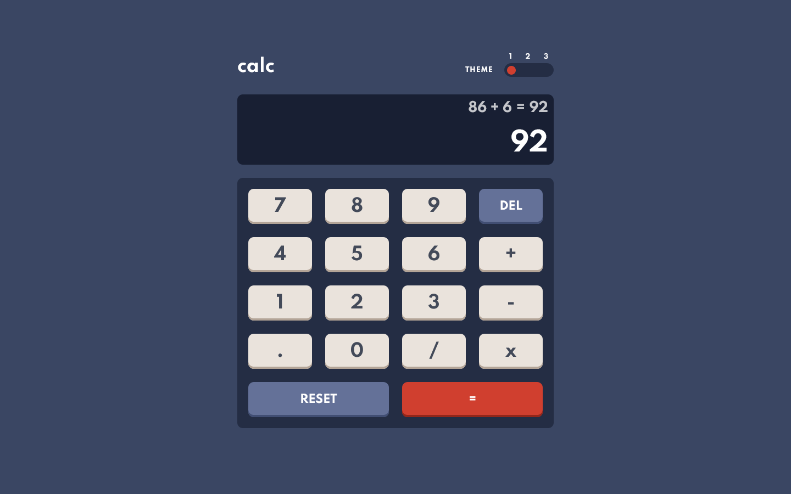
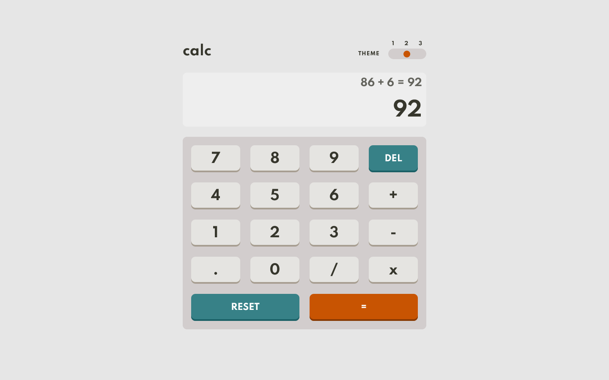
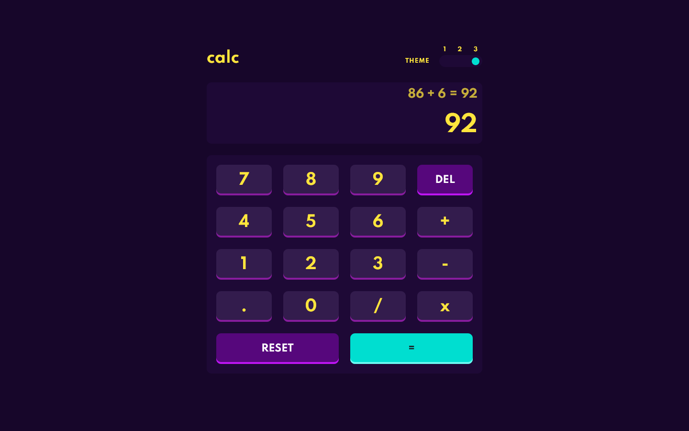
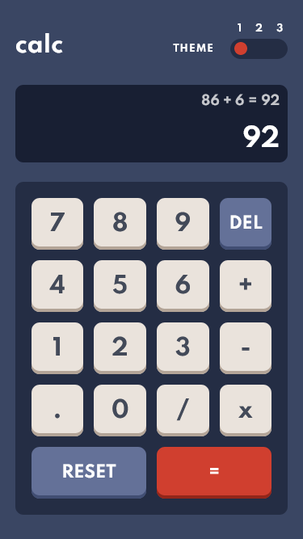
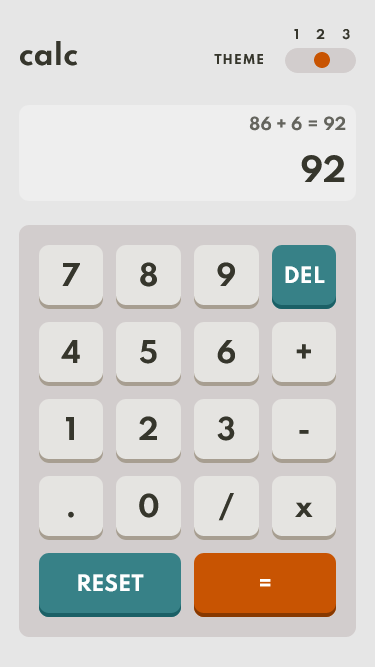

# Frontend Mentor - Calculator app solution

This is a solution to the [Calculator app challenge on Frontend Mentor](https://www.frontendmentor.io/challenges/calculator-app-9lteq5N29) coded by [Alain-sys](https://github.com/Alain-sys)

## Table of contents

- [Overview](#overview)
  - [The challenge](#the-challenge)
  - [Screenshot](#screenshot)
  - [Links](#links)
- [My process](#my-process)
  - [Built with](#built-with)
  - [What I learned](#what-i-learned)
  - [Continued development](#continued-development)
  - [Useful resources](#useful-resources)
- [Author](#author)
- [Acknowledgments](#acknowledgments)

## Overview

### The challenge

Users should be able to:

- See the size of the elements adjust based on their device's screen size
- Perform mathmatical operations like addition, subtraction, multiplication, and division
- Adjust the color theme based on their preference
- **Bonus**: Have their initial theme preference checked using `prefers-color-scheme` and have any additional changes saved in the browser

### Screenshot

  
Desktop

  
  
  

  
Mobile

  

    
    
  

  

    
  

### Links

- [Live Site URL](https://alain-sys.github.io/calculator-app/)
- [Solution URL]()

## My process

### Built with

- Semantic HTML5 markup
- CSS custom properties
- Flexbox
- CSS Grid
- Media queries
- Javascript

### What I learned

I have learned more about js and more precisely about the class object and the local storage.

### Continued development

I would like to progress in js and learn REACT 

### Useful resources

- [MDN](https://developer.mozilla.org/fr/)
- [Stackoverflow](https://stackoverflow.com/) 

## Author

- Frontend Mentor - [@Alain-sys](https://www.frontendmentor.io/profile/Alain-sys)
- Github - [Alain-sys](https://github.com/Alain-sys)

## Acknowledgments

Thanks to [WebDevSimplified](https://github.com/WebDevSimplified) for his great [video on youtube](https://www.youtube.com/watch?v=j59qQ7YWLxw) which helped me a lot for this challenge.

